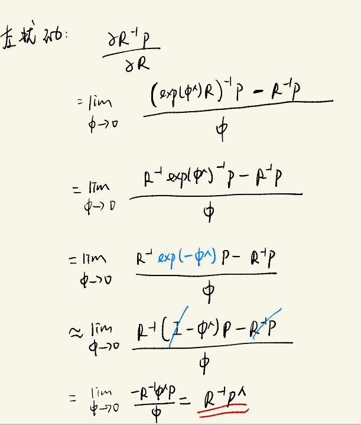
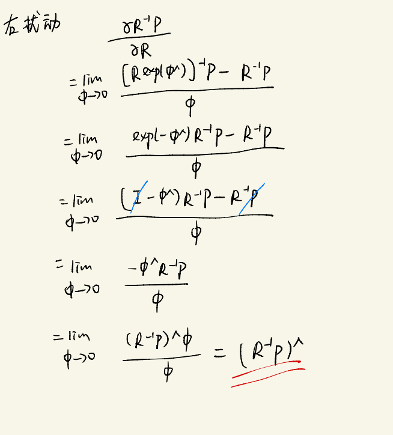
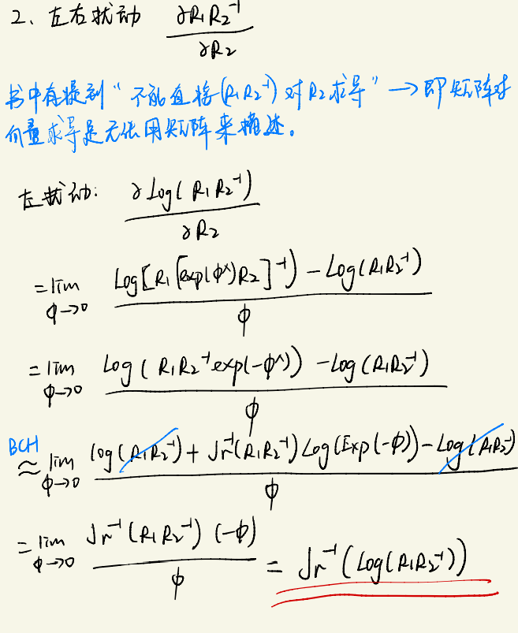
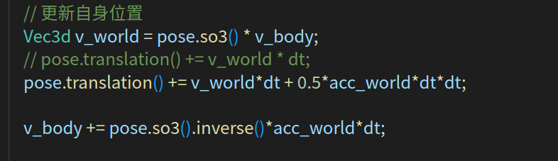
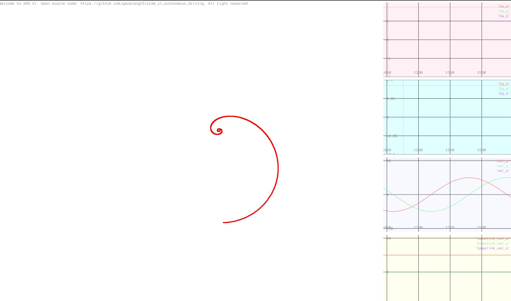
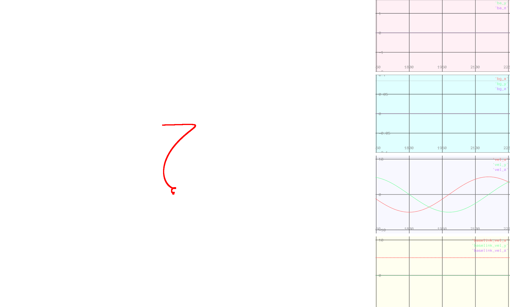

# 第1章 作业

### 1 左右扰动模型，计算$\frac{\partial{R^{-1}p}}{R}$

### 2 左右扰动模型，计算$\frac{\partial{R^{-1}p}}{R}$

### 3 将实践环节中的运动学模型修改成带一定角速度的平抛运动。车辆受固定的Z轴角速度影响，具有一定的初始水平速度，同时受-z方向的重力加速度影响。修改程序，给出动画演示。
代码：

效果：
俯视

侧面平视图

### 4 自行寻找相关材料，说明高斯牛顿法和L-M在处理非线性迭代时的差异
1. 高斯牛顿的核心——求解增量方程 $ H\Delta{x} = b $，那么需要计算海森矩阵H的逆 $H^{-1}$，但是实际计算是用$H = JJ^{T}$近似的，可能出现$JJ^{T}$呈现病态或者奇异矩阵的情况，这个时候增量的稳定性是很差的，导致算法不稳定， 最终造成不收敛的情况。
2. L-M其实就是G-N的变种。对于每次迭代，在G-N的基础上添加信赖区域，最终通过拉格朗日乘子将新添加约束放到目标函数中 —— 实际上，就是对增量方程做了改进。对于L-M的增量方程——$ (H+\lambda I)\Delta{x} = b $，其中$\lambda$很小的时候，L-M接近G-N；$\lambda$很大的时候,L-M就是最速下降法。因为$\lambda$的存在，$JJ^{T}+\lambda I$保证是正定矩阵，在一定程度上避免了系数矩阵病态的问题。
